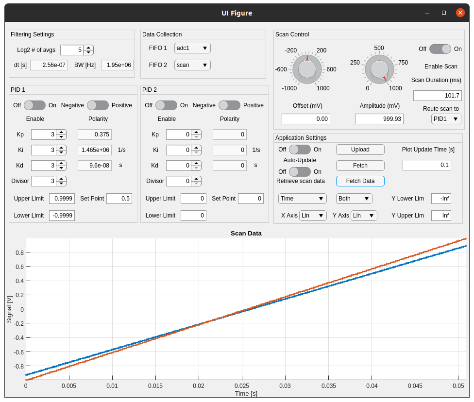
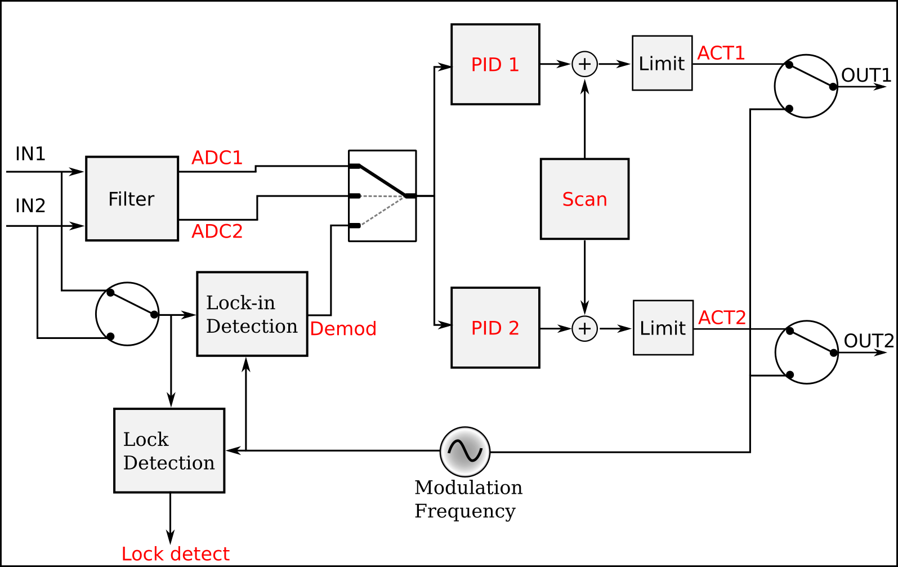
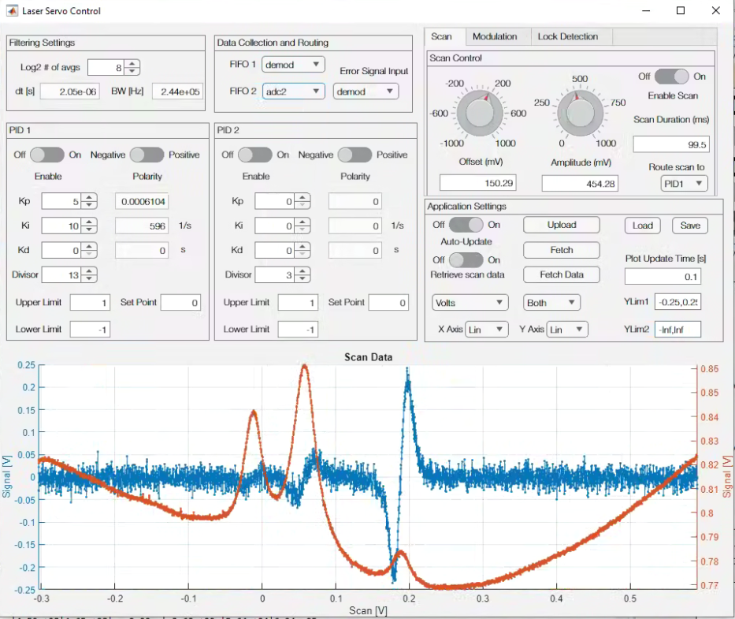
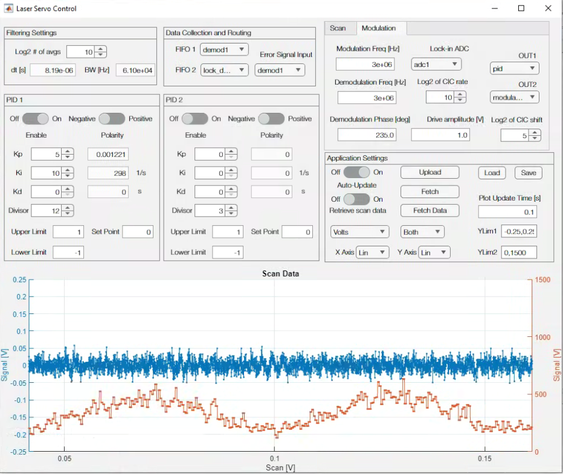
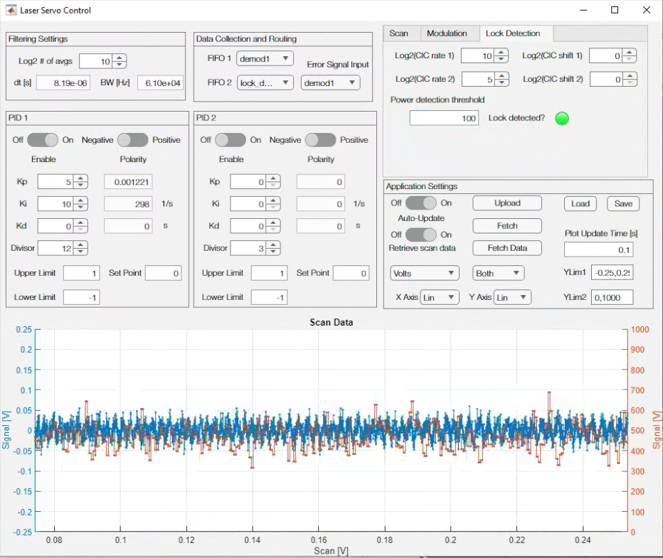

# Red Pitaya Laser Servo

This project implements a digital two-channel laser servo using a Red Pitaya/STEMlab-14 development board in a single-input multiple-output (SIMO) configuration.  An error signal can be provided to either the 'IN1' or 'IN2' SMA connectors, and this is then directed to two independently controlled PID controllers.  The outputs of the two PID controllers are then routed to the ports 'OUT1' and 'OUT2' which can then be connected to the desired laser inputs such as piezo and current drivers.  

In order to position the laser frequency within the capture range of the error signal a built-in scan generator can be enabled and its range and offset changed by the user.  This scan can be added internally to the output of either of the PID controllers.  When either PID controller is enabled, the scan is automatically disabled but the offset of the scan is still added to the relevant controller so that the laser frequency starts the lock within the capture range of the error signal.  In order to minimize mode-hops in the laser, the scan is implemented as a symmetrical triangle waveform.

Scan data can be collected from within the FPGA during the positive ramp of the scan, and data from two channels can be collected in a first-in first-out (FIFO) buffer that has 4096 entries and is 32 bits wide.  The data for each channel is represented as 16 bit signed integers which means that each channel can have up to 4096 entries.

The servo can be controlled remotely from another computer using a MATLAB class and GUI.  A Python socket server runs on the Red Pitaya and interfaces with the programmable logic using a memory-mapped AXI interface, and the MATLAB programs communicate with the socket server using TCP/IP.  The MATLAB class `LaserServo.m` serves as a representation of the current state of the device, and the GUI provides a visual display of this state.  Additionally, the GUI can continuously fetch scan data from the FIFO and display it in near real-time.  

# Set up

## Hardware

Connect the Red Pitaya (RP) to power via the USB connector labelled PWR (on the underside of the board), and connect the device to the local network using an ethernet cable.  Connect your input signals to the IN1 and IN2 connectors, and note that there are on-board jumpers labelled LV and HV that control the attenuation of the input signal.  LV allows for signals of $\pm 1$ V, while HV allows signals of $\pm 20$ V.  You will also need to connect the outputs as required for your particular locking setup.  If you are using a modulation scheme to generate the error signal, such as frequency modulation spectroscopy or modulation transfer spectroscopy, you can either generate the modulation and do the lock-in detection external to the Red Pitaya, or you can do both internally.  For external modulation, you will need to supply the generated error signal to one of the Red Pitaya inputs.  For internal modulation, you will need to supply a signal that carries the modulation to one of the inputs.  Depending on the amplitude of the AC modulation signal, you may want to AC couple and amplify it beforehand.

## Software

The following step-by-step instructions will guide you through the software setup.

  1. Clone both this repository and the interface repository at [https://github.com/atomlaser-lab/red-pitaya-interface](https://github.com/atomlaser-lab/red-pitaya-interface) to your computer.  

  2. Using SSH (via terminal on Linux/Mac or something like PuTTY on Windows), log into the RP using the hostname `rp-{MAC}.local` where `{MAC}` is the last 6 characters of the RP's MAC address, which is written on the ethernet connector.  Your network may assign its own domain, so `.local` might not be the correct choice.  The default user name and password for RPs is `root`.  Once logged in, create two directories called `laser-servo` and `server`.

  3. From this repository, copy over all files ending in `.c` and `Makefile` to the `laser-servo` directory on the RP using either `scp` (from a terminal on your computer) or using your favourite GUI (I recommend WinSCP for Windows).  Also copy over the file `fpga/laser-servo.bit` to the `laser-servo` directory.  From the interface repository, copy over all files ending in '.py' and the file 'get_ip.sh' to the `server` directory on the RP.

  4. On the RP and in the `laser-servo` directory, compile the C programs by running the command `make` with no arguments.

  5. In the `server` directory, change the privileges of `get_ip.sh` using `chmod a+x get_up.sh`.  Check that running `./get_ip.sh` produces a single IP address (you may need to install dos2unix using `apt install dos2unix` and then run `dos2unix get_ip.sh` to make it work).  If it doesn't, run the command `ip addr` and look for an IP address that isn't `127.0.0.1` (which is the local loopback address).  There may be more than one IP address -- you're looking for one that has tags 'global' and 'dynamic'.  Here is the output from one such device:
   ```
   root@rp-f0919a:~# ip addr
   1: lo: <LOOPBACK,UP,LOWER_UP> mtu 65536 qdisc noqueue state UNKNOWN group default qlen 1
      link/loopback 00:00:00:00:00:00 brd 00:00:00:00:00:00
      inet 127.0.0.1/8 scope host lo
         valid_lft forever preferred_lft forever
      inet6 ::1/128 scope host 
         valid_lft forever preferred_lft forever
   2: eth0: <BROADCAST,MULTICAST,UP,LOWER_UP> mtu 1500 qdisc pfifo_fast state UP group default qlen 1000
      link/ether 00:26:32:f0:91:9a brd ff:ff:ff:ff:ff:ff
      inet 169.254.176.82/16 brd 169.254.255.255 scope link eth0
         valid_lft forever preferred_lft forever
      inet 192.168.1.109/24 brd 192.168.1.255 scope global dynamic eth0
         valid_lft 77723sec preferred_lft 77723sec
   3: sit0@NONE: <NOARP> mtu 1480 qdisc noop state DOWN group default qlen 1
      link/sit 0.0.0.0 brd 0.0.0.0
   ```
   The IP address we want here is the address `192.168.1.109` as it has the `global` tag, which is what `get_ip.sh` looks for.  If you have your RP connected directly to your computer it will not work and you will have to specify the IP address manually.

   6. Upload the bitstream to the FPGA by navigating to the `laser-servo` directory and running `cat laser-servo.bit > /dev/xdevcfg`.

   7. Start the Python server by running `python3 /root/server/appserver.py`.  If you need to specify your IP address run instead `python3 /root/server/appserver.py <ip address>`.  The script will print the IP address it is using on the command line.  This will block the command line, but you can suspend the program using `CTRL+Z` and placing it into the background using `bg`, which will not block the command line.  If you want the program to continue running after you have closed the SSH connection, then use `nohup python3 /root/server/appserver.py & disown`.

   8. On your computer in MATLAB, add the interface repository directory to your MATLAB path.

   9. Navigate to this repository's software directory (or add it to the MATLAB path), and create a new control object using `servo = LaserServo(<ip address>)` where `<ip address>` is the IP address of the RP.  If the FPGA has just been reconfigured, set the default values using `servo.setDefaults` and upload them using `servo.upload`.  If you want to retrieve the current operating values use the command `servo.fetch`.

   10. You can control the device using the command line, but you can also use a GUI to do so.  Start the GUI by running the command `ControlGUI(servo)`.  This will start up the GUI.  You can also run `ControlGUI(<ip address>)` if you don't have the `LaserServo` object in your workspace.


### After a reboot or power-on

You will need to re-configure the FPGA and start the Python socket server after a reboot.  To re-configure the FPGA run the command `cat laser-servo.bit > /dev/xdevcfg` from the `laser-servo` directory, and then start the Python server again.

### After starting/restarting the SSH session

You will need to check that the socket server is running.  Run the command `ps -ef | grep appserver.py`.  This will print out a list of processes that match the pattern `appserver.py`.  One of these might be the `grep` process itself -- not especially useful -- but one might be the socket server.  Here's an example output:
```
root      5768  5738  7 00:59 pts/0    00:00:00 python3 /root/server/appserver.py
root      5775  5738  0 01:00 pts/0    00:00:00 grep --color=auto appserver.py
```
The first entry is the actual socket server process and the second one is the `grep` process.  If you need to stop the server, and it is not in the jobs list (run using `jobs`), then you can kill the process using `kill -15 5768` where `5768` is the process ID of the process (the first number in the entry above).  

If you want the server to run you don't need to do anything.  If the server is not running, start it using `python3 /root/server/appserver.py`.  

## Interfacing with MATLAB

Start up MATLAB on your computer and either navigate to the 'software/' folder or add that folder to the MATLAB path.  Create a `LaserServo` object in your workspace using
```
dev = LaserServo(<IP Address>);
```
where `<IP Address>` is a character string of the IP address (or hostname, technically) of the RP.  So if the socket server tells you on start-up that it is listening on '192.168.1.109' then run
```
dev = LaserServo('192.168.1.109');
```  
You can then fetch the current device parameters using
```
dev.fetch
```
which will retrieve the data from the device via the socket server and will display the device properties on the command line.

To start the GUI, you can either run
```
ControlGUI(dev);
% OR
ControlGUI(<IP Address>);
```
if you don't want to have the object representing your device in your workspace.  This should start the GUI, and the latter command will also fetch current settings automatically.

An example image of the GUI is shown below where the red trace (ADC2) shows a saturated absorption spectroscopy signal of the D2 F = 2 -> F' transition in Rb-87, and the blue trace (ADC1) shows the modulation-transfer spectroscopy signal.



There are obviously many parameters that can be changed regarding the device and the GUI.  Focusing only on those related to the GUI, under 'Application Settings', if you want to see continuous updates of the data, switch the toggle switch 'Retrieve scan data' to 'On' and it will automatically retrieve data from the socket server for you and automatically upload the current settings to the device.  The lag in the update is due to the nature of the TCP/IP connection, so changing the 'Plot Update Time' to anything shorter than 0.1 s will not improve the bandwidth of the display.

The plot display can be changed using the settings under 'Application Settings', and these should be straightforward.  When 'Retrieve scan data' is set to 'Off', you can use the 'Upload' button to upload the current settings to the device, 'Fetch' to fetch the device's settings, and 'Fetch Data' to fetch the most recent data from the device.  Note that if you make a change to the settings and upload them, and then fetch the data, that data will not reflect your changes - you will need to fetch the data a second time.


# Description

A simplified diagram of the FPGA logic is shown below.



Incoming data from the ADCs has two paths: either it is filtered (ADC1 and ADC2) and then used as the error signal for the two PID controllers, or it is subjected to lock-in detection at the modulation frequency to produce a demodulated signal (Demod) which can also be used as the error signal for the PID controllers.  The outputs of the PID controllers (PID1 and PID2) can then be added to the output of a symmetrical triangular ramp generator (Scan), before being limited to minimum and maximum values to produce actuator values ACT1 and ACT2.  These can then be directed to the outputs (pins OUT1 and OUT2).  Alternatively, one of OUT1 and OUT2 can be used to output the modulation signal used for lock-in detection.  A lock detection module (not to be confused with *lock-in* detection) uses the second harmonic of the modulation frequency to detect if the laser is locked by monitoring the power in the second harmonic.  This only works when using the internal modulation generated by the FPGA.

Data can be stored in a first-in first-out (FIFO) buffer on the FPGA for later retrieval and processing by the user.  Signals in **red** are signals that can be stored in the FIFO.  The FIFO can store any pair of red signals.

# Use

The servo can be controlled from the MATLAB command line, but users will probably find it easier to control using the supplied GUI.  A screenshot of the GUI when scanning is shown below for a modulation transfer spectroscopy setup.  The blue signal is the MTS spectrum used as the error signal, and the red signal is the lock detection signal derived from the power in the second harmonic.



Below we will describe the operation of the different modules in the GUI.

## Filtering Settings

The initial filter is used to reduce the incoming data to a rate that can be easily handled in the FPGA without pipelining, and it also improves the signal-to-noise ratio.  This filter is implemented as an averaging and decimating filter.  It takes the two raw ADC data streams and averages them in non-overlapping windows that have widths given by $2^N$ where $N$ is an integer value.  This reduces the sample rate by a factor of $2^N$, and in the GUI this is displayed by the read-only fields `dt` and `BW`.

## Data Collection

This allows the user to select at what points data should be stored in the FIFO buffer for later retrieval.  Locations where the data streams can be tapped are shown in the schematic diagram in red.  Additionally, the user can select which ADC is recording the error signal.

## Scan

The scan is a symmetric triangular waveform which can be specified by its offset, amplitude, and scan duration (period).  The scan can be enabled or disabled using the sliding switch on the top right.  This setting is ignored when either PID is engaged.  You can also set which output/PID the scan should be routed to with the selection box.  Depending on which PID the scan is routed to, it is clipped by the PID output limits.  The scan offset is *always* added the PID output to which the scan is routed, so that the user can center the error signal on the display, corresponding to the scan being at the offset value, and then lock the laser by switch the relevant PID controller to "Enabled".

When the x-axis plot display is set to "Volts" (see Application Settings), you can click on the plot to set the scan offset to that value automatically.  This should aid in locking to a transition.

## Modulation

The modulation tab controls the internal modulation signal generator and the lock-in detection settings.  



In this version, the modulation and demodulation frequencies can be different.  The modulation signal has an output voltage given by `Drive amplitude` which is the approximate peak output voltage into $50$ $\rm\Omega$.  What the two outputs on the RP produce can be controlled by the drop-down menus on `OUT1` and `OUT2`: `pid` selects the output of the respective PID controller, and `modulation` outputs the modulation signal.  The ADC used for demodulation can be selected using the drop-down menu `Lock-in ADC`.  Lock-in detection occurs using the `Demodulation phase` value, and this is filtered by a so-called CIC filter at a decimating rate of $2^N$ where $N$ is the value of `Log2 of CIC rate`.  The demodulated signal can be amplified/deamplified digitally using the `Log2 of CIC shift` value, which scales it by $2^A$ for value $A$.  Note that this does not increase the SNR, but it may be useful if the signal is too small and there is digitisation noise on the signal.    

## PID 1 & 2

The PIDs can be enabled or disabled independently -- when either is enabled the scan is disabled internally.  The polarity of the PIDs can also be changed, where a positive polarity computes the error signal as $\rm measurement - control$ and a negative polarity computes it as $\rm control - measurement$.  Discrete gain values $K_p$, $K_i$, and $K_d$ can be set corresponding to the proportional, integral, and derivative gains, respectively.  These are given as integer values, so to allow for fractional values after multiplication in the FPGA these values are divided by $2^M$ where $M$ is labelled as the 'divisor' and is an integer value.  The approximate 'real' gains for the continuous-controller-equivalent are shown in the greyed out boxes to the right.  For more details on this implementation, see equation 2 and the discussion thereof in [this RSI article](https://doi.org/10.1063/1.5128935) for more information (a non-paywalled version can be found [here](https://crsty.ca/ryan/wiki/lib/exe/fetch.php?media=kjaergaard_lab:papers:thomas_2020.pdf).)

Upper and lower limits to the PID outputs can be set, and they cannot exceed +/- 1 V due to limitations on the RP's output voltages.  The `Set Point` value is the value at which to stabilise the error signal -- it is the $\rm control$ value in the above discussion.  Normally this will be 0 V, but it can be other values to compensate for offsets in the error signal.

## Lock detection

Lock-in detection at the fundamental will generate a signal proportional to the first derivative of the absorption spectrum, which is useful for producing an error signal.  Lock-in detection at the second harmonic will generate a signal proportional to the second derivative, and this can be used to detect if the laser is locked as there will only be power in the second harmonic when it is on resonance with the atomic transition.



Because the signal level in the second harmonic is much less than the fundamental, lock detection uses two cascaded CIC filters with their own rates and re-scaling.  This improves the SNR at the cost of bandwidth, but as it is only being used for lock detection the bandwidth is mostly irrelevant.  Lock detection requires a threshold power, and when the power in the second harmonic is above this value (in arbitrary units) the "LED" on the GUI will turn green.  Additionally, one of the orange LEDs on the Red Pitaya (the one closest to ethernet and power connectors) will flash on and off at about 1 Hz.  

## Application settings

These control the application's settings.  When `Auto-update` is on, the application automatically sends changed parameter values to the Red Pitaya.  `Retrive scan data` will constantly retrieve scan data from the FIFOs when enabled.  The delay between retrievals is given by `Plot Update Time`.  Buttons `Upload`, `Fetch`, and `Fetch Data` will upload current parameters, fetch parameters from the device, and fetch scan data, respectively.  Application and servo configurations can be saved and loaded using the `Save` and `Load` buttons.  

Scan data can be plotted in time, volts, or PSD according to the drop-down menu.  When in `Volts`, you can click on the figure axes and the scan offset will automatically adjust to be centered on that position when the scan is enabled and the PIDs are disabled.  `PSD` will calculate and plot the PSD of the recorded signals.  The x and y axes scalings can be adjust with their respective drop-down menus.  Axes limits can be adjusted using the text fields on the right.

# TODO

 - Implement 2 scan modules for the two controllers, add logic for 2 SISO controllers as well as 1 SIMO controller
 - Implement slow scan via PWM outputs
