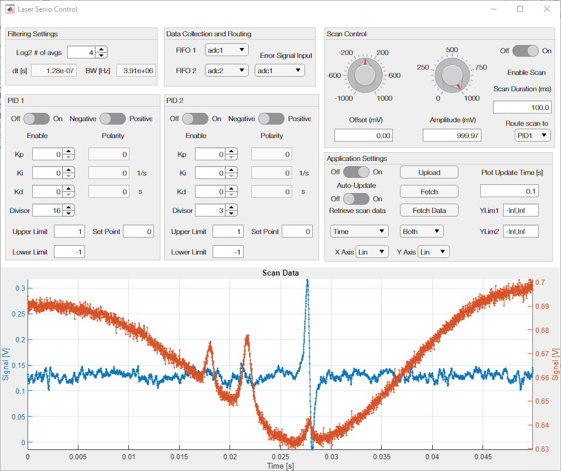
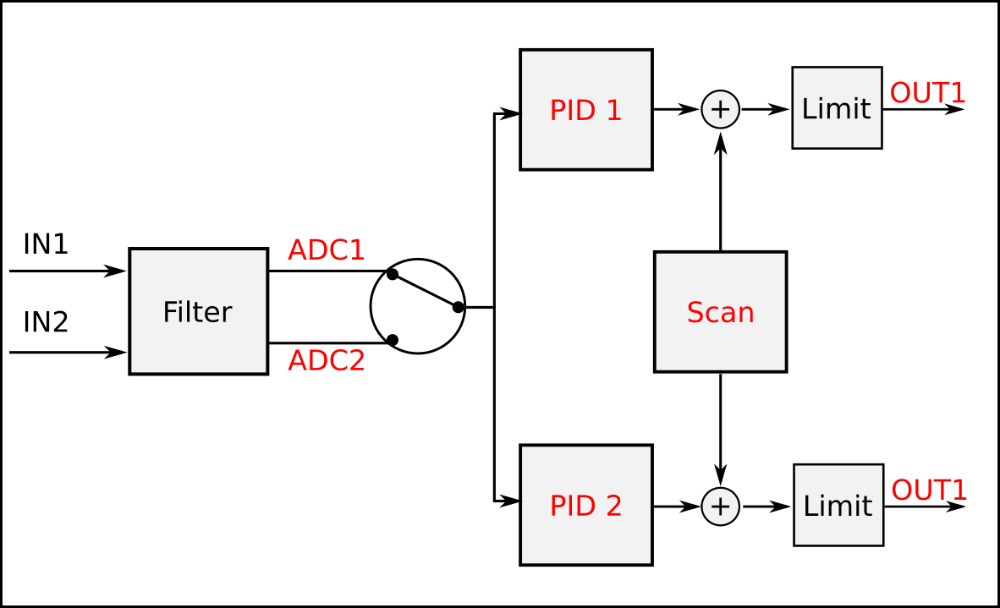

# Red Pitaya Laser Servo

This project implements a digital two-channel laser servo using a Red Pitaya/STEMlab-14 development board in a single-input multiple-output (SIMO) configuration.  An error signal can be provided to either the 'IN1' or 'IN2' SMA connectors, and this is then directed to two indepedently controlled PID controllers.  The outputs of the two PID controllers are then routed to the ports 'OUT1' and 'OUT2' which can then be connected to the desired laser inputs such as piezo and current drivers.  

In order to position the laser frequency within the capture range of the error signal a built-in scan generator can be enabled and its range and offset changed by the user.  This scan can be added internally to the output of either of the PID controllers.  When either PID controller is enabled, the scan is automatically disabled but the offset of the scan is still added to the relevant controller so that the laser frequency starts the lock within the capture range of the error signal.  In order to minimize mode-hops in the laser, the scan is implemented as a symmetrical triangle waveform.

Scan data can be collected from within the FPGA during the positive ramp of the scan, and data from two channels can be collected in a first-in first-out (FIFO) buffer that has 4096 entries and is 32 bits wide.  The data for each channel is represented as 16 bit signed integers which means that each channel can have up to 4096 entries.

The servo can be controlled remotely from another computer using a MATLAB class and GUI.  A Python socket server runs on the Red Pitaya and interfaces with the programmable logic using a memory-mapped AXI interface, and the MATLAB programs communicate with the socket server using TCP/IP.  The MATLAB class `LaserServo.m` serves as a representation of the current state of the device, and the GUI provides a visual display of this state.  Additionally, the GUI can continuously fetch scan data from the FIFO and display it in near real-time.  

# Set up

## Starting the Red Pitaya

Connect the Red Pitaya (RP) to power via the USB connector labelled PWR (on the underside of the board), and connect the device to the local network using an ethernet cable.  Log into the device using SSH with the user name `root` and password `root` using the hostname `rp-{MAC}.local` where `{MAC}` is the last 6 characters in the device's MAC address - this will be printed on the ethernet connector of the device.

### First use

Copy over the files in the 'software/' directory ending in '.py', the file 'get_ip.sh', and the file 'saveScanData.c' using either `scp` (from a terminal on your computer) or your favourite GUI (I recommend WinSCP for Windows).  You will also need to copy over the file 'fpga/laser-servo.bit' which is the device configuration file.  If using `scp` from the command line, navigate to the main project directory on your computer and use
```
scp fpga/laser-servo.bit software/*.py software/get_ip.sh software/saveScanData.c root@rp-{MAC}.local:/root/
```
and give your password as necessary.  You can move these files to a different directory on the RP after they have been copied.

Next, change the execution privileges of `get_ip.sh` using `chmod a+x get_ip.sh`.  Check that running `./get_ip.sh` produces a single IP address.  If it doesn't, run the command `ip addr` and look for an IP address that isn't `127.0.0.1` (which is the local loopback address).  There may be more than one IP address -- you're looking for one that has tags 'global' and 'dynamic'.  Here is the output from one such device:
```
root@rp-f0919a:~# ip addr
1: lo: <LOOPBACK,UP,LOWER_UP> mtu 65536 qdisc noqueue state UNKNOWN group default qlen 1
    link/loopback 00:00:00:00:00:00 brd 00:00:00:00:00:00
    inet 127.0.0.1/8 scope host lo
       valid_lft forever preferred_lft forever
    inet6 ::1/128 scope host 
       valid_lft forever preferred_lft forever
2: eth0: <BROADCAST,MULTICAST,UP,LOWER_UP> mtu 1500 qdisc pfifo_fast state UP group default qlen 1000
    link/ether 00:26:32:f0:91:9a brd ff:ff:ff:ff:ff:ff
    inet 169.254.176.82/16 brd 169.254.255.255 scope link eth0
       valid_lft forever preferred_lft forever
    inet 192.168.1.109/24 brd 192.168.1.255 scope global dynamic eth0
       valid_lft 77723sec preferred_lft 77723sec
3: sit0@NONE: <NOARP> mtu 1480 qdisc noop state DOWN group default qlen 1
    link/sit 0.0.0.0 brd 0.0.0.0
```
In this case the one we want is the address `192.168.1.109`.  In this case, `get_ip.sh` will work because it looks for an IP address starting with `192.168`.  If your IP address starts with something else, you will need to edit the `get_ip.sh` file and change the numbers to reflect your particular network.

Finally, compile the program `saveScanData.c` using `gcc -o saveScanData saveScanData.c`.  This will automatically be executable.

### After a reboot or power-on

You will need to re-configure the FPGA and start the Python socket server after a reboot.  To re-configure the FPGA run the command
```
cat laser-servo.bit > /dev/xdevcfg
```

To start the Python socket server run
```
python3 appserver.py &
```
This should print a line telling you the job number and process ID  as, for example, `[1] 5760`, and a line telling you that it is 'Listening on' and then an address and port number.  The program will not block the command line and will run in the background as long as the SSH session is active (The ampersand & at the end tells the shell to run the program in the background).  To stop the server, run the command `fg 1` where `1` is the job number and then hit 'CTRL-C' to send a keyboard interrupt.

### After starting/restarting the SSH session

You will need to check that the socket server is running.  Run the command
```
ps -ef | grep appserver.py
```
This will print out a list of processes that match the pattern `appserver.py`.  One of these might be the `grep` process itself -- not especially useful -- but one might be the socket server.  Here's an example output:
```
root      5768  5738  7 00:59 pts/0    00:00:00 python3 appserver.py
root      5775  5738  0 01:00 pts/0    00:00:00 grep --color=auto appserver.py
```
The first entry is the actual socket server process and the second one is the `grep` process.  If you need to stop the server, and it is not in the jobs list (run using `jobs`), then you can kill the process using `kill -15 5768` where `5768` is the process ID of the process (the first number in the entry above).  

If you want the server to run you don't need to do anything.  If the server is not running, start it using `python3 appserver.py`.  

## Interfacing with MATLAB

Start up MATLAB on your computer and either navigate to the 'software/' folder or add that folder to the MATLAB path.  Create a `LaserServo` object in your workspace using
```
dev = LaserServo(<IP Address>);
```
where `<IP Address>` is a character string of the IP address (or hostname, technically) of the RP.  So if the socket server tells you on start-up that it is listening on '192.168.1.109' then run
```
dev = LaserServo('192.168.1.109');
```  
You can then fetch the current device parameters using
```
dev.fetch
```
which will retrieve the data from the device via the socket server and will display the device properties on the command line.

To start the GUI, you can either run
```
ControlGUI(dev);
% OR
ControlGUI(<IP Address>);
```
if you don't want to have the object representing your device in your workspace.  This should start the GUI, and the latter command will also fetch current settings automatically.

An example image of the GUI is shown below where the red trace (ADC2) shows a saturated absorption spectroscopy signal of the D2 F = 2 -> F' transition in Rb-87, and the blue trace (ADC1) shows the modulation-transfer spectroscopy signal.



There are obviously many parameters that can be changed regarding the device and the GUI.  Focusing only on those related to the GUI, under 'Application Settings', if you want to see continuous updates of the data, switch the toggle switch 'Retrieve scan data' to 'On' and it will automatically retrieve data from the socket server for you and automatically upload the current settings to the device.  The lag in the update is due to the nature of the TCP/IP connection, so changing the 'Plot Update Time' to anything shorter than 0.1 s will not improve the bandwidth of the display.

The plot display can be changed using the settings under 'Application Settings', and these should be straightforward.  When 'Retrieve scan data' is set to 'Off', you can use the 'Upload' button to upload the current settings to the device, 'Fetch' to fetch the device's settings, and 'Fetch Data' to fetch the most recent data from the device.  Note that if you make a change to the settings and upload them, and then fetch the data, that data will not reflect your changes - you will need to fetch the data a second time.

# Use

A simplified diagram of the FPGA logic is shown below.



Red text indicates locations where signals can be tapped to store in the FIFOs.  Below is a description of the different modules and their settings.

## Filter

The initial filter is used to reduce the incoming data to a rate that can be easily handled in the FPGA without pipelining, and it also improves the signal-to-noise ratio.  This filter is implemented as an averaging and decimating filter.  It takes the two raw ADC data streams and averages them in windows that have widths given by `2^(log2Avgs)` where `log2Avgs` is an integer value.  This reduces the sample rate by a factor of `2^(log2Avgs)`, and in the GUI this is displayed by the read-only fields `dt` and `BW`.

## Data Collection

This allows the user to select at what points data should be stored in the FIFO buffer for later retrieval.  Locations where the data streams can be tapped are shown in the previous diagram in red.  Additionally, the user can select which ADC is recording the error signal.

## Scan Control

The scan is a symmetric triangular waveform which can be specified by its offset, amplitude, and scan duration (period).  The scan can be enabled or disabled using the sliding switch on the top right.  This setting is ignored when either PID is engaged.  You can also set which output/PID the scan should be routed to with the selection box.  Depending on which PID the scan is routed to, it is clipped by the PID output limits.  The scan offset is *always* added the PID output to which the scan is routed, so that the user can center the error signal on the display, corresponding to the scan being at the offset value, and then lock the laser by switch the relevant PID controller to "Enabled".

When the x-axis plot display is set to "Volts", you can click on the plot to set the scan offset to that value automatically.  This should aid in locking to a transition.

## PID 1 & 2

The PIDs can be enabled or disabled independently -- when either is enabled the scan is disabled internally.  The polarity of the PIDs can also be changed, where a negative polarity computes the error signal as `measurement - control` and a positive polarity computes it as `control - measurement`.  Discrete gain values `Kp`, `Ki`, and `Kd` can be set corresponding to the proportional, integral, and derivative gains, respectively.  These are given as integer values, so to allow for fractional values after multiplication in the FPGA these values are divided by `2^(Divisor)` where `Divisor` is an integer value.  The approximate 'real' gains for the continuous-controller-equivalent are shown in the greyed out boxes to the right.  For more details on this implementation, see equation 2 and the discussion thereof in [this RSI article](https://doi.org/10.1063/1.5128935) for more information (a non-paywalled version can be found [here](https://crsty.ca/ryan/wiki/lib/exe/fetch.php?media=kjaergaard_lab:papers:thomas_2020.pdf).)

Upper and lower limits to the PID outputs can be set, and they cannot exceed +/- 1 V due to limitations on the RP's output voltages.  The `Set Point` value is the value at which to stabilise the error signal -- it is the `control` value in the above discussion.  Normally this will be 0 V, but it can be other values to compensate for offsets in the error signal.


# TODO

 - Implement 2 scan modules for the two controllers, add logic for 2 SISO controllers as well as 1 SIMO controller
 - Add CIC filter
